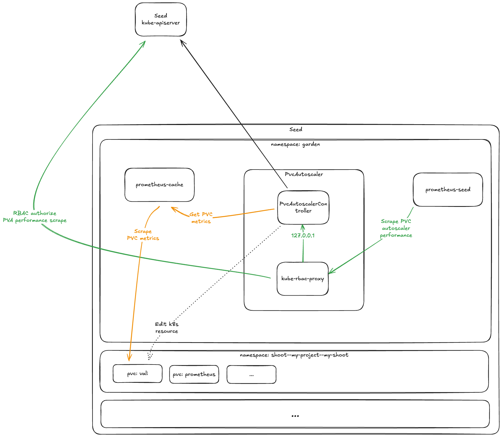

# GEP-29: Autoscaling Storage Volumes
## _Notes_
___

### Metrics authorization
`pvc-autoscaler` supports access control over its `/metrics` endpoint. This feature will not be utilised by the first
implementation round. It is envisioned as a future enhancement. In that operation mode,
the primary `pvc-autoscaler` container publishes unauthorized, plain text metrics only on the loopback interface.
Peer pods are configured to look for `/metrics` at a different port, which is served by a secondary container, running
the `kube-rbac-proxy`[[2]] application. It serves HTTPS and authenticates and authorizes each request against the runtime
cluster via the TokenReview[[3]] and SubjectAccessReview[[4]] K8s APIs, before forwarding it to the internal, insecure
loopback port.

_Fig.3: Runtime structure with secure metrics_

The `kube-rbac-proxy` container is excluded from autoscaling, and runs with fixed resource requests. Pod evictions
driven by such a lean container are unjustified, as they would only achieve minimal resource savings, and disrupt
the main container.

